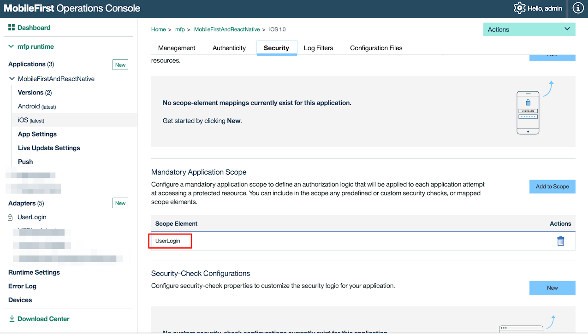

# Running MobileFirst Foundation 8.0 And React Native

This sample will show you how you can run [React Native](https://facebook.github.io/react-native/) project with MobileFirst foundation Server and SDKs.

## Demo

## Prerequisites
* [Pre-installed React Native](https://facebook.github.io/react-native/docs/getting-started.html).
* [Pre-installed IBM MobileFirst Platform development environment](https://mobilefirstplatform.ibmcloud.com/tutorials/en/foundation/8.0/setting-up-your-development-environment/).
* [Install Git](https://git-scm.com/book/en/v2/Getting-Started-Installing-Git).
* [Install NodeJS / npm](https://docs.npmjs.com/getting-started/installing-node).
* [Install the latest Android Studio](https://developer.android.com/studio/install.html)
* [Install the latest XCode](https://developer.apple.com/download/)

> Link to MobileFirst Foundation 8.0 And React Native sample in the [following link](https://github.com/mfpdev/mf-foundation-and-react-native)  

## Running the sample

- Clone this [Git repository](https://github.com/mfpdev/mf-foundation-and-react-native).

- Install project dependencies by run `npm install` from terminal window.

- Register the app/s (iOS/Android) in MobileFirst Foundation Server.

  - From each folder in the project ([ios](./ios)/[Android](./android)) run the following bash command:
  ```
  mfpdev app register
  ```
- Build & Deploy the *MF Blog RSS adapter*
  - Create the adapter
    - From terminal run the following bash command:
    ```
    mfpdev adapter create
    ```
    > Important: choose HTTP as adapter type.

  - Build the adapter
    - From terminal run the following bash command:
    ```
    mfpdev adapter build
    ```

  - Deploy the adapter
    - From the adapter root folder run the following command:
    ```
    mfpdev adapter deploy
    ```

- Build & Deploy the *UserLogin Security Check*:
  - Download the UserLogin security check adapter sample from [MobileFirst console samples](http://localhost:9080/mfpconsole/index.html#/downloads#samples) or from the [following link](https://hub.jazz.net/git/imflocalsdk/console-samples/contents/master/UserLogin.zip)

  - For build & deploy the security check repeat the steps from Build & Deploy the *MF Blog RSS adapter*

- Configure the default security scope on MobileFirst Foundation console for each application platform:
  - In your browser go to [MobileFirst Foundation Console](http://localhost:9080/mfpconsole)
  - In each platform of your application set the default scope to be *UserLogin*


  

- Run the application:
  - You can run each application (Android/iOS) from terminal by run the following bash commands:
  ```
  react-native run-ios
  ```

  > For Android you need to have connected device or simulator before running the bash command below

  ```
  react-native run-android
  ```
  - Or you can now open each native project (Android/iOS) which located under [android](./android)/[ios](./ios) folders.
